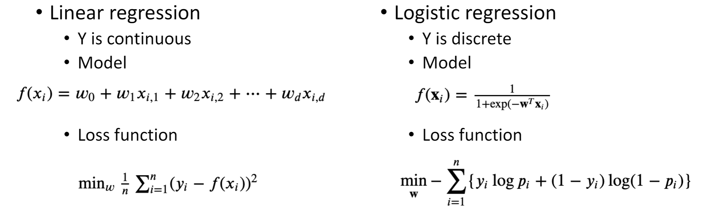
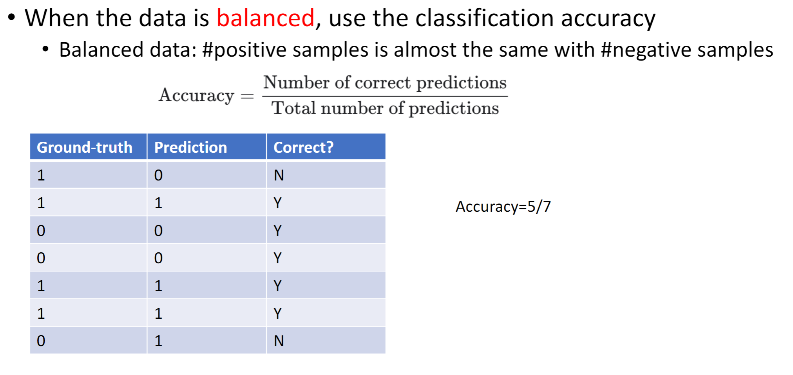

February 16th, 2023

First, we go over quiz answers- I got all 3 T/F and the question on hwo to avoid overfitting. The objective function for linear regression I got hilariously wrong. This is the objective function of linear regression: $min_w \thinspace ||Y - Xw||_2$

*Negative log-likelihood function*: $\sum_{j=1}^n \left \{y_iw^Tx_i - log(1 + exp(w^Tx_i)) \right\}$ 

Use gradient descent to optimize the loss function.

Loss Function: $min_w \thinspace \sum_{i=1}^n log(1 + exp(w^Tx_i)) - y_iw^Tx_i$
Gradient of Loss Function: $\frac{\delta L}{\delta w} = \sum_{i=1}^n x_i \left( y_i - \frac{w^Tx_i}{1+exp)w^Tx_i} \right)$

### Linear vs Logistic Regression

| Type     | Features           |
| -------- | ------------------ |
| Linear   | - Y is continuous, |
| Logistic | - Y is discrete                   |

**Linear**: $f(x_i) = w_0 +w_1x_1 \dots w_dx_d$
Logistic: $f(x_i) = \frac{1}{1+exp(w^Tx_i)}$

### Classification Evaluation

For logistic regression, when the data is balanced (roughly same amount of 0s and 1s), we simply take how many correct predictions we made and divide it by the total number of predictions.

Be careful! Accuracy is not a good metric when the data is imbalanced- imagine a model that always predicts 0, and the data it is given is 6 0s and 1 1! The accuracy would be 6/7, but clearly the model is not very good. 

|                       | Positive (ground-truth) | Negative(ground-truth) |
| --------------------- | ----------------------- | ---------------------- |
| Positive (Prediction) | True Positive           | False Positive         |
| Negative (Prediction) | False Negative          | True Negative                       |

Above are the 4 kinds of classifications, trivially understood from their names. 

*Recall*: the proportion of actual positives that are correctly classified. 
	$Recall = \frac{TP}{TP+FN}$
**Precision**: The proportion of positive predictions that are actually correct. 
	$Precision = \frac{TP}{TP + FP}$ 

Now that we have defined there terms, we can redefine our accuracy calculation-
	$Accuracy = \frac{TP + TN}{TP +TN + FN + FP}$

Recall and Precision are much better evaluators for unbalanced data.