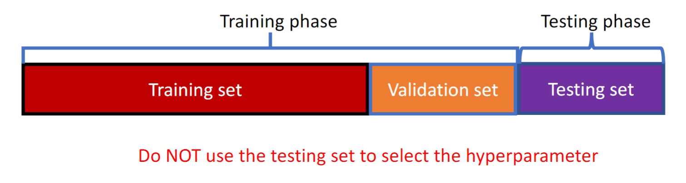

February 16th, 2023

First, we go over quiz answers- I got all 3 T/F and the question on hwo to avoid overfitting. The objective function for linear regression I got hilariously wrong. This is the objective function of linear regression: $min_w \thinspace ||Y - Xw||_2$

*Negative log-likelihood function*: $\sum_{j=1}^n \left \{y_iw^Tx_i - log(1 + exp(w^Tx_i)) \right\}$ 

Use gradient descent to optimize the loss function.

Loss Function: $min_w \thinspace \sum_{i=1}^n log(1 + exp(w^Tx_i)) - y_iw^Tx_i$
Gradient of Loss Function: $\frac{\delta L}{\delta w} = \sum_{i=1}^n x_i \left( y_i - \frac{w^Tx_i}{1+exp)w^Tx_i} \right)$

### Linear vs Logistic Regression

| Type     | Features           |
| -------- | ------------------ |
| Linear   | - Y is continuous, |
| Logistic | - Y is discrete                   |

**Linear**: $f(x_i) = w_0 +w_1x_1 \dots w_dx_d$
Logistic: $f(x_i) = \frac{1}{1+exp(w^Tx_i)}$

### Classification Evaluation

For logistic regression, when the data is balanced (roughly same amount of 0s and 1s), we simply take how many correct predictions we made and divide it by the total number of predictions.

Be careful! Accuracy is not a good metric when the data is imbalanced- imagine a model that always predicts 0, and the data it is given is 6 0s and 1 1! The accuracy would be 6/7, but clearly the model is not very good. 

|                       | Positive (ground-truth) | Negative(ground-truth) |
| --------------------- | ----------------------- | ---------------------- |
| **Positive (Prediction)** | True Positive           | False Positive         |
| **Negative (Prediction)** | False Negative          | True Negative                       |

Above are the 4 kinds of classifications, trivially understood from their names. 

*Recall*: the proportion of actual positives that are correctly classified. 
	$Recall = \frac{TP}{TP+FN}$
**Precision**: The proportion of positive predictions that are actually correct. 
	$Precision = \frac{TP}{TP + FP}$ 
Now that we have defined there terms, we can redefine our accuracy calculation-
	$Accuracy = \frac{TP + TN}{TP +TN + FN + FP}$

Recall and Precision are much better evaluators for unbalanced data.

When should we care about *Recall* and *Precision*?

When we really care about finding all positive samples, we should definitely focus on maximizing recall. A larger recall -> more ground-truth samples are found.
When users are sensitive to prediction error, we should maximize precision. A large precision means the positive prediction has a higher probability to be correct.

*F1 Score*: The harmonic mean of precision and recall, which conveys the balance between the precision and the recall.
	$F_1 = \frac{2*Recall* Precision}{Recall + Precision}$

### Summary of Regression

1. Build the Model
	- Linear classifier to separate positive and negative samples
2. Optimize the Model
	- Gradient Descent
3. Evaluate the Model
	- Balanced Data: Accuracy
	- Imbalanced Data: Recall, Precision, F1 Score

New Model Pattern: **Threefold Split**

Before, we had a training phase to train the model and a testing phase, to predict new data. With a threefold split, we add a third phase as part of the training phase called the validation phase. We use this phase to select a hyperparameter for regularization. So, we now follow the following pattern:

For each hyperparameter, we will train the model using the training set and then evauluate the parameter with the validation set. Every time we pick a new parameter, we retrain the model on the training set and validation set. After selecting the best hyperparameter, we combine the training and validation sets and do a final retrain of our model.