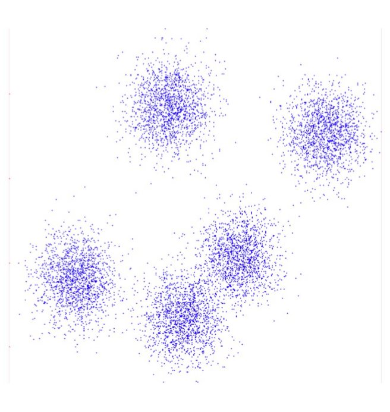
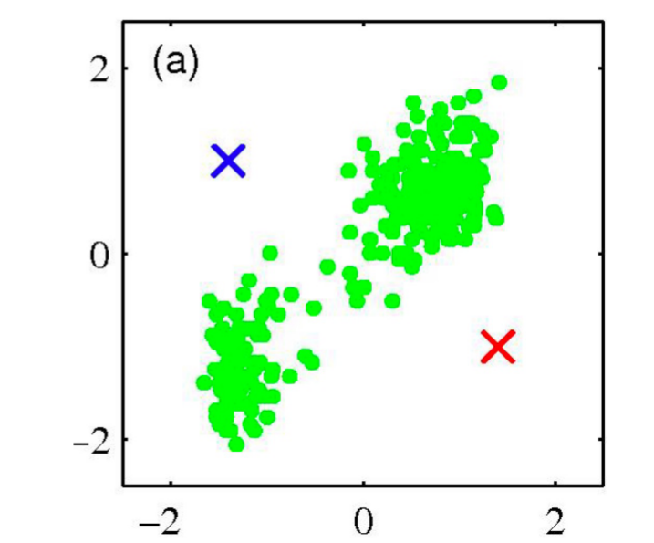
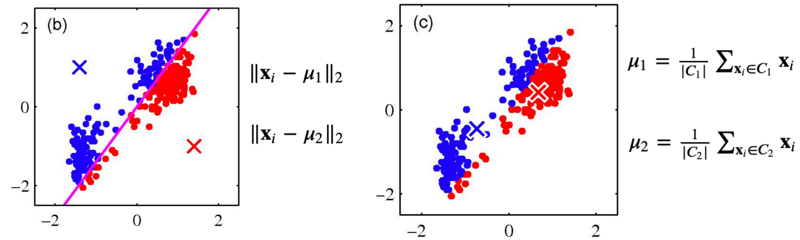
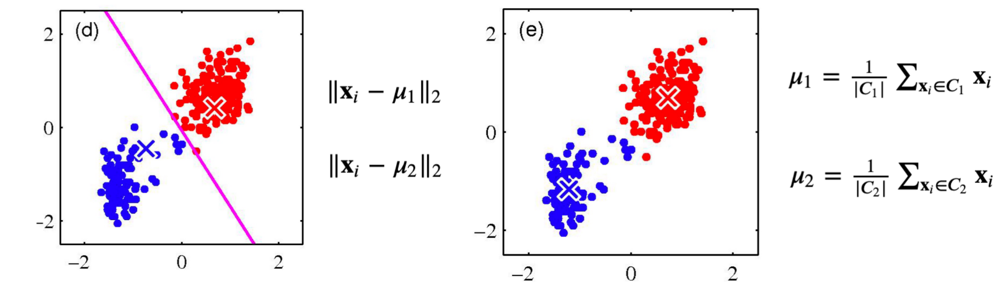
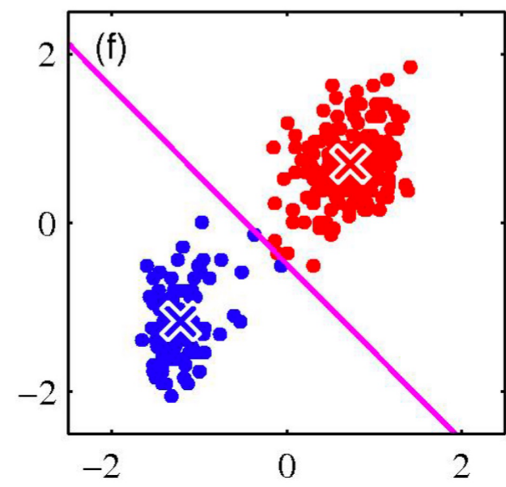
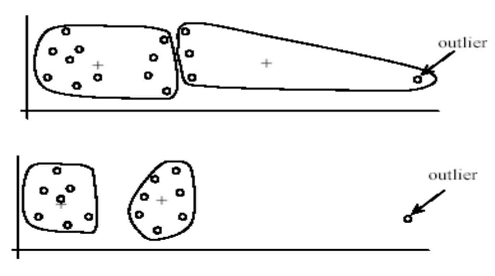

March 14th, 2023

Happy pie day!

Unsupervised Learning AKA Clustering: We are given only the samples- we do NOT know any labels. Clustering looks for similar samples.

For clustering, we first must partition our data by some metric:

### K-Means Clustering

Given some dataset $\{x_1, x_2, \dots, x_n\}$, K-Means partitions the data into K clusters- each cluster has a cluster center, called a centroid.

**Procedure**:
1. Randomly initialize the cluster centroids $\mu_1, \mu_2, \dots, \mu_k$
2. Repeat the following until no change in $\mu_k$:
	1. Classify N samples in terms of the nearest cluster centroid
	2. Re-compute the cluster centroid

The following are graphical depictions of the above algorithm- the crosses are the centroids, initally random and then computed.

Strengths of K-Means:
	Very simple to implement
	Fairly Efficient- O(KNT), where K is the # of means, N is the # samples, T is the # of iterations
Weaknesses of K-Means:
	Only applicable when means are defined
	Sensitive to outlier
	Sensitive to initialization (the randomly chosen starting clusters)

Example of outliers strongly affecting the clusters:

### Agglomerative Clustering

Algorithm:
1. Initialize each sample as a cluster
2. Repeat the following until there is only 1 cluster
	1. Pick the two nearest clusters
	2. Merge them into a new cluster

