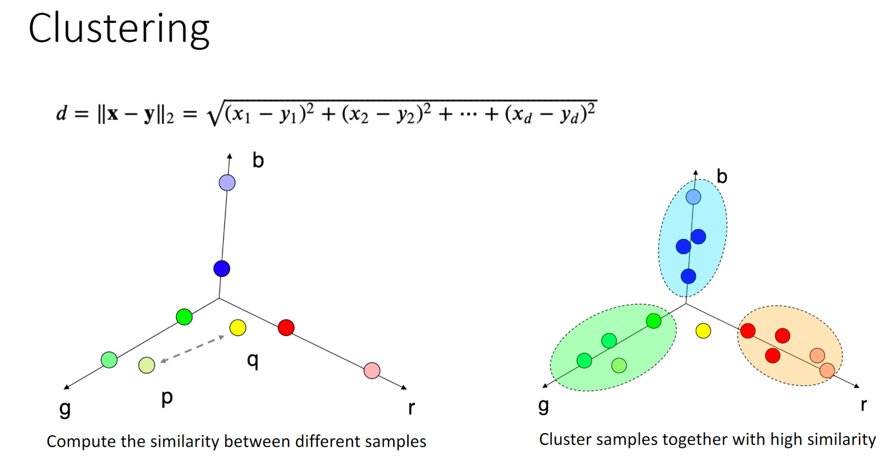
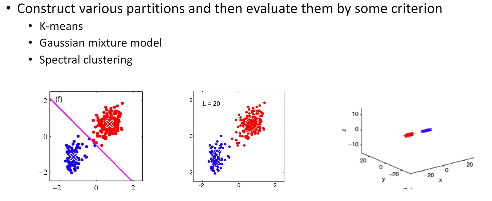

March 14th, 2023

Happy pie day!

Unsupervised Learning AKA Clustering: We are given only the samples- we do NOT know any labels. Clustering looks for similar samples.

For clustering, we first must partition our data by some metric:

