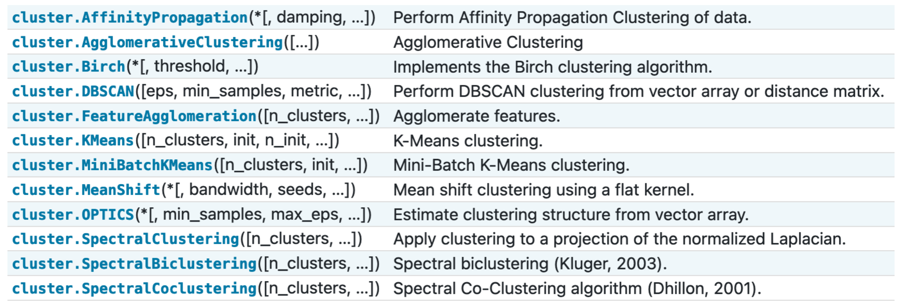
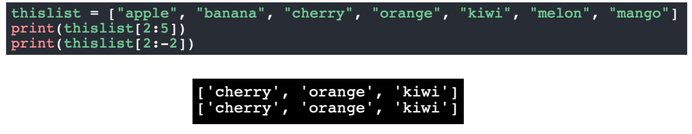
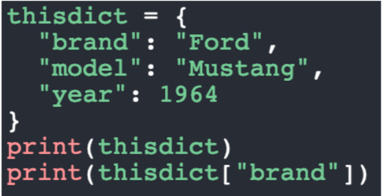
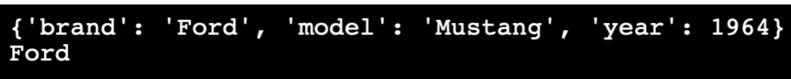

January 19th, 2023

<h3> NumPy </h3>
Basic Array operations
```python
a = np.array([1,2,3])
b = np.array([4,5,6])

np.inner(a, b) # = [4, 10, 18]
```

<h3> SciKitLearn </h3>
Machine Learning library



<h3> Other Tools </h3>
[PyTorch](https://pytorch.org) - Deep Learning tools developed by facebook
[TensorFlow](https://www.tensorflow.org) - Deep learning tools developed by google
[Matplotlib](https://matplotlib.org) - Plotting library in python

<h3> Python Basics </h3>
<center> <b>List</b> </center>

Ordered, Mutable, and allow duplicates. Lists are python's simplest array-like data set. It's syntax seems like an array in many other languages, but python doesn't support fixed-length arrays in this way.

```python
a = ["hello", "world", "bro"]
print(a[0]) # hello
print(a[-1]) # bro
print(a[0:2]) # ['hello', 'world']
print(a[0:-2]) # ['hello', 'world']
```


There are three ways to add to a list- append, insert, and extend. They do exactly what they say, in classic python fashion.

Python lists can only have their elements removed by value, NOT by index-

```python
a = ["hi", "there"]
a.remove(0) # RUNTIME ERROR
a.remove("hi") # a = ["there"]
a = [0,2,0]
a.remove(0) # a = [2,0]
```

<center><b> Tuple </b></center>
Tuples are similar to lists, however while they have a fixed order like lists, they are not mutable- that is, they cannot be changed, updated, or resized after being declared.

```python
a = (1,2,3,4)
print(a[0]) # 1
```

Interestingly, tuples in python can be destructured like objects in Javascript:
```python
a = (1,2,3)
(one, two, three) = a # one = 1, two = 2, three = 3
```

<center><b> Dictionary </b></center>

Dictionaries are key:value pairs, exactly like a map in other languages. They are an unordered, mutable datastructure with the restriction that you cannot have duplicate keys. Dictionaries are a great way to optimize many algorithms, as they allow O(1) lookup and modification times (amortized).




You can access the items in a dictionary in a few ways-

dict.keys() - returns a dict_keys object that contains an iterable list of the keys.
dict.