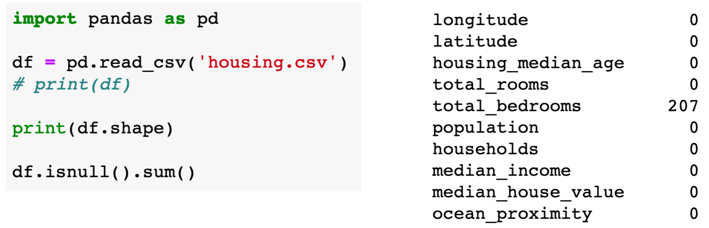

January 31, 2023

I missed two days of classes, here is a summary-
- Visualizing data
- That's it
- I didn't miss anything.
- All the python techniques are in the slides.
	*SUMMARY ENDS HERE*
Boxplot
- Boxplots are good!
- min, 25%, median, 75%, max
- Care for outliers, you want your min and max values to be outlier-free
Scatter Plots
- Can reveal correlations or dependencies in data
- `df.corr()` calculates correlation for each attribute in your data, high correlation value = strong correlation
With tabular data, we have the underlying assumption that each sample/row/piece of data is independant from each other. How do we represent data that is not independant (relational data)?
Graph Data
- Unweighted graphs show relationships, weighted graphs show dependance
- networkx is a good python library
### Data Preprocessing

##### Outline
- Missing Values
- Categorical Features
- Normalization

#### Why is Data Processing Important

`df.isnull()` gives a same-shape object of Booleans indicating whether or not a value is missing (NaN) or not.

If more than 50% of the values are missing, it is probably safe to simply remove the feature entirely. We can check this very easily-

In a lot of situations, we would rather fill the missing data than remove a feature from analysis entirely. Two easy solutions are to fill in each missing datapoint with the mean or median of said feature. 