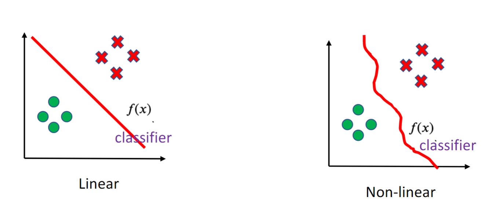
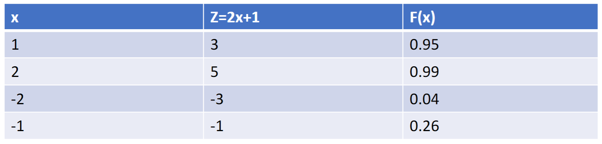

February 14th, 2023

Summary of What I think I missed:
- Build Model
	- $f(x_i) = w_0 + w_1x_{i,1} + w_2x_{i,2} \dots w_dx_{i, d}$ 
- Split the data set, about 70/30 training and testing.
- Gradient Descent
	- $x_{t+1} = x_t - n \nabla f(x_t)$ 
	- Basically move in the opposite direction of the gradient to minimize the loss function ($f(x_t)$).
	- Linear Regression: $min_w ||y - Xw||^2$ has gradient $-2X^T(y-Xw)$, so gradient descent looks like this:
		- $w_{t+1} = w_t - n(2X^T(Xw_t - y))$
- Overfitting: Errors on training data is very good, but errors on new data points are very large.
	- How to avoid? add a regularization term - basically a constant to stop overfitting
	- Ridge Regression: use l-2 norm
		- $min_w \frac{1}{n} ||y-Xw||^2_2 + \lambda||w||^2_2$ 
	- Lasso: use l-1 norm
		- $min_w \frac{1}{n} ||y - Xw||_1 + \lambda||w||_1$
	- Difference: Lasso Model will always have a sparse vector, whereas ridge regression will have a vector of differences

### Classification

*Binary Classification*: Only two classes, 0-1, fraud-not fraud etc.
A classical example of a binary classification problem is detecting if an email is spam or not.
*Multi-Class Classification*: Many classes to classify.

##### Binary Classification
- Learn a classifier to seperate positive samples from negative samples
	- A good practice to get into is to use 0 and 1 as labels

Given n-samples: $\{(x_1, y_1), (x_2, y_2), \dots , (x_n, y_n)\}$
Then, learn a mapping function $f: X \times Y \rightarrow \{0, 1\}$ 
 

Lineat Classifier: $z(x) = w^Tx = w_0 + w_1x_1 + \dots + w_dx_d$ <- Inner Product
$z(x) = 0$ specifies a linear boundary, separating the data into two half-spaces (seen above).

$\hat{y} = \{1, z(x) > 0\} \thinspace || \thinspace \{0, z(x) < 0\}$

Here is an example of the above classifier ($\hat{y}$):

### Logistic Regression

Now we introduce the sigmoid function

- If z > 0, the function value is close to 1 => predict 1
- if z < 0, the function value is close to 0 => predict 0
- if z = 0, the function value is 0.5

$\sigma(z) = \frac{1}{1 + exp(-z)}$ 

So, if $\sigma(z) > 0.5$, predict 1 and vice versa.

$f(x_i) = \frac{1}{1 + exp(-w^Tx_i)}$

Here is the same example as above with the function defined above:

We can also interpret this function from a probablistic POV: $p(y = 1 \thinspace | \thinspace x) = \sigma(w^Tx) = \frac{1}{1 + exp(-w^Tx)} = \frac{exp(w^Tx)}{1 + exp(w^Tx)}$ 
Since there are only two classes (Binary Classification), we can get the probablity of y = 0 given x like so: $p(y = 0 \thinspace | \thinspace x) = 1 - p(y = 1 \thinspace | \thinspace x)$

#### Likelihood Function

We can use a likelihood function to measure how well our model fits the data

$L(\theta) = p(x_1;\theta)p(x_2;\theta)\dots p(x_n;\theta)$ 